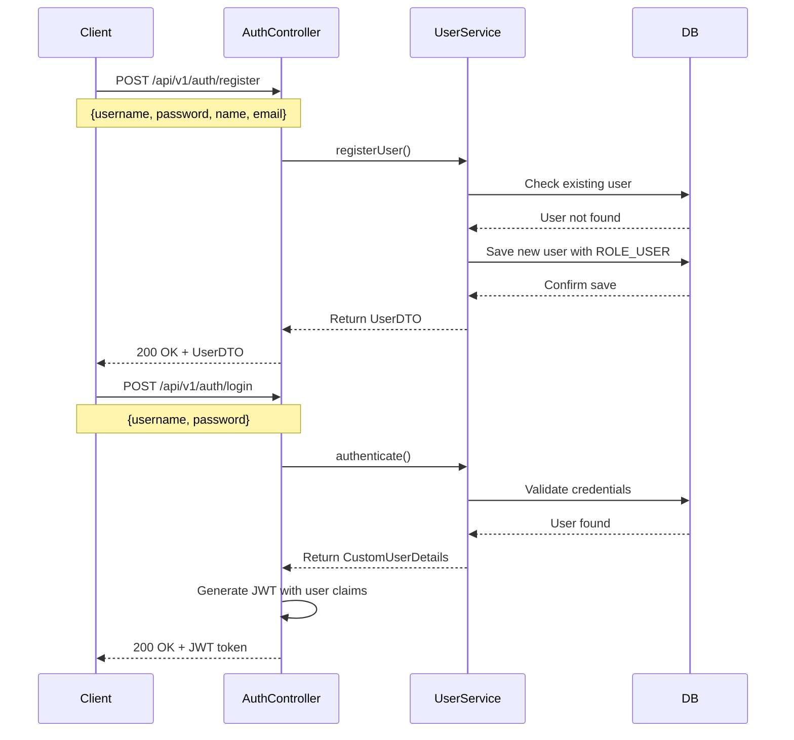
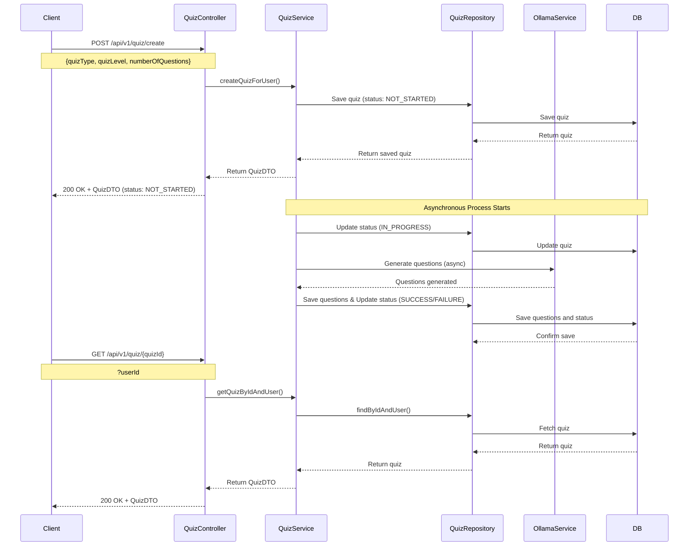
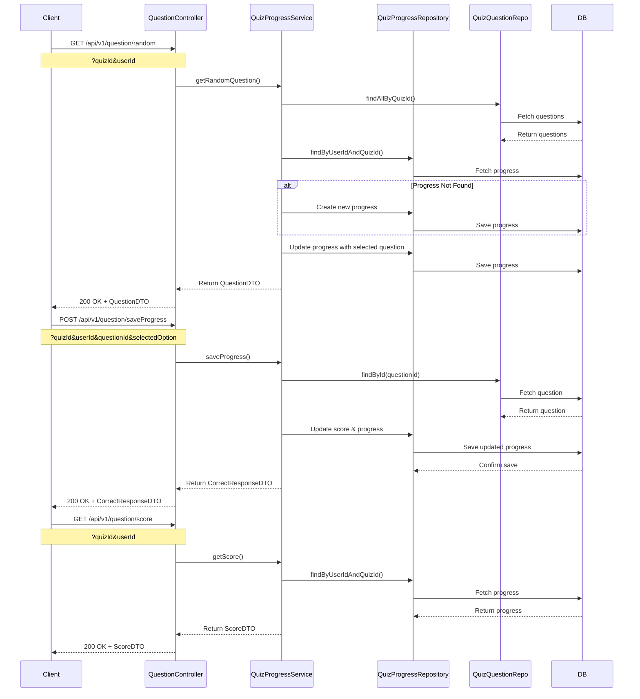

# Mind Maze API Sequence Diagrams

## Authentication Flow

```mermaid
sequenceDiagram
    participant Client
    participant AuthController
    participant UserService
    participant DB
    
    %% Registration Flow
    Client->>AuthController: POST /api/v1/auth/register
    Note over Client,AuthController: {username, password, name, email}
    AuthController->>UserService: registerUser()
    UserService->>DB: Check existing user
    DB-->>UserService: User not found
    UserService->>DB: Save new user with ROLE_USER
    DB-->>UserService: Confirm save
    UserService-->>AuthController: Return UserDTO
    AuthController-->>Client: 200 OK + UserDTO

    %% Login Flow
    Client->>AuthController: POST /api/v1/auth/login
    Note over Client,AuthController: {username, password}
    AuthController->>UserService: authenticate()
    UserService->>DB: Validate credentials
    DB-->>UserService: User found
    UserService-->>AuthController: Return CustomUserDetails
    AuthController->>AuthController: Generate JWT with user claims
    AuthController-->>Client: 200 OK + JWT token
```

## Quiz Management Flow

```mermaid
sequenceDiagram
    participant Client
    participant QuizController
    participant QuizService
    participant QuizRepository
    participant OllamaService
    participant DB

    %% Create Quiz Flow
    Client->>QuizController: POST /api/v1/quiz/create
    Note over Client,QuizController: {quizType, quizLevel, numberOfQuestions}
    QuizController->>QuizService: createQuizForUser()
    QuizService->>QuizRepository: Save quiz (status: NOT_STARTED)
    QuizRepository->>DB: Save quiz
    DB-->>QuizRepository: Return quiz
    QuizRepository-->>QuizService: Return saved quiz
    QuizService-->>QuizController: Return QuizDTO
    QuizController-->>Client: 200 OK + QuizDTO (status: NOT_STARTED)
    
    Note over QuizService,DB: Asynchronous Process Starts
    QuizService->>QuizRepository: Update status (IN_PROGRESS)
    QuizRepository->>DB: Update quiz
    QuizService->>OllamaService: Generate questions (async)
    OllamaService-->>QuizService: Questions generated
    QuizService->>QuizRepository: Save questions & Update status (SUCCESS/FAILURE)
    QuizRepository->>DB: Save questions and status
    DB-->>QuizRepository: Confirm save

    %% Get Quiz Flow
    Client->>QuizController: GET /api/v1/quiz/{quizId}
    Note over Client,QuizController: ?userId
    QuizController->>QuizService: getQuizByIdAndUser()
    QuizService->>QuizRepository: findByIdAndUser()
    QuizRepository->>DB: Fetch quiz
    DB-->>QuizRepository: Return quiz
    QuizRepository-->>QuizService: Return quiz
    QuizService-->>QuizController: Return QuizDTO
    QuizController-->>Client: 200 OK + QuizDTO
```

## Quiz Progress Flow

```mermaid
sequenceDiagram
    participant Client
    participant QuestionController
    participant QuizProgressService
    participant QuizProgressRepository
    participant QuizQuestionRepo
    participant DB

    %% Get Question Flow
    Client->>QuestionController: GET /api/v1/question/random
    Note over Client,QuestionController: ?quizId&userId
    QuestionController->>QuizProgressService: getRandomQuestion()
    QuizProgressService->>QuizQuestionRepo: findAllByQuizId()
    QuizQuestionRepo->>DB: Fetch questions
    DB-->>QuizQuestionRepo: Return questions
    QuizProgressService->>QuizProgressRepository: findByUserIdAndQuizId()
    QuizProgressRepository->>DB: Fetch progress
    alt Progress Not Found
        QuizProgressService->>QuizProgressRepository: Create new progress
        QuizProgressRepository->>DB: Save progress
    end
    QuizProgressService->>QuizProgressRepository: Update progress with selected question
    QuizProgressRepository->>DB: Save progress
    QuizProgressService-->>QuestionController: Return QuestionDTO
    QuestionController-->>Client: 200 OK + QuestionDTO

    %% Save Progress Flow
    Client->>QuestionController: POST /api/v1/question/saveProgress
    Note over Client,QuestionController: ?quizId&userId&questionId&selectedOption
    QuestionController->>QuizProgressService: saveProgress()
    QuizProgressService->>QuizQuestionRepo: findById(questionId)
    QuizQuestionRepo->>DB: Fetch question
    DB-->>QuizQuestionRepo: Return question
    QuizProgressService->>QuizProgressRepository: Update score & progress
    QuizProgressRepository->>DB: Save updated progress
    DB-->>QuizProgressRepository: Confirm save
    QuizProgressService-->>QuestionController: Return CorrectResponseDTO
    QuestionController-->>Client: 200 OK + CorrectResponseDTO

    %% Get Score Flow
    Client->>QuestionController: GET /api/v1/question/score
    Note over Client,QuestionController: ?quizId&userId
    QuestionController->>QuizProgressService: getScore()
    QuizProgressService->>QuizProgressRepository: findByUserIdAndQuizId()
    QuizProgressRepository->>DB: Fetch progress
    DB-->>QuizProgressRepository: Return progress
    QuizProgressService-->>QuestionController: Return ScoreDTO
    QuestionController-->>Client: 200 OK + ScoreDTO
```
