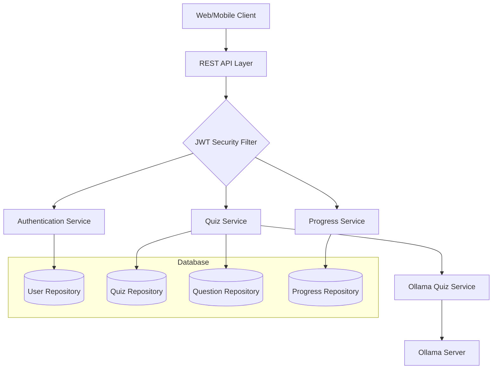
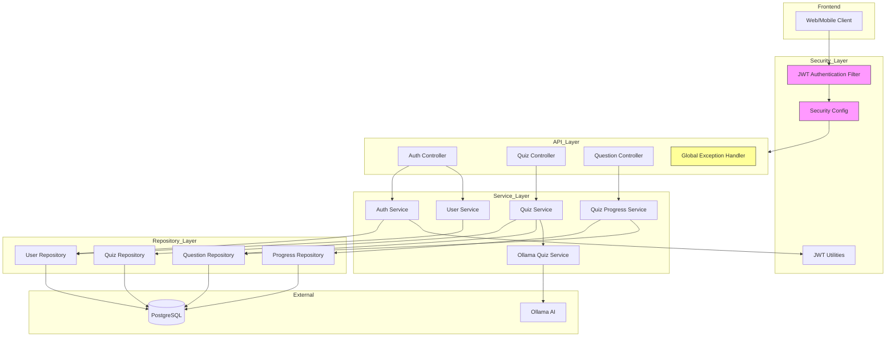

# Mind Maze AI Components

## High-Level Architecture

```mermaid
graph TB
    Client[Web/Mobile Client] --> API[REST API Layer]
    API --> Security{JWT Security Filter}
    Security --> Auth[Authentication Service]
    Security --> Quiz[Quiz Service]
    Security --> Progress[Progress Service]
    
    Auth --> UserRepo[(User Repository)]
    Quiz --> QuizRepo[(Quiz Repository)]
    Quiz --> QuestionRepo[(Question Repository)]
    Quiz --> AIService[Ollama Quiz Service]
    AIService --> Ollama[Ollama Server]
    Progress --> ProgressRepo[(Progress Repository)]
    
    subgraph Database
        UserRepo
        QuizRepo
        QuestionRepo
        ProgressRepo
    end
```

## Detailed Component Diagram

```mermaid
graph TD
    subgraph Frontend
        Client[Web/Mobile Client]
    end
    
    subgraph Security_Layer
        JWTFilter[JWT Authentication Filter]
        SecurityConfig[Security Config]
        JWTUtil[JWT Utilities]
    end
    
    subgraph API_Layer
        Auth[Auth Controller]
        Quiz[Quiz Controller]
        Question[Question Controller]
        GlobalError[Global Exception Handler]
    end
    
    subgraph Service_Layer
        AuthService[Auth Service]
        UserService[User Service]
        QuizService[Quiz Service]
        ProgressService[Quiz Progress Service]
        AIService[Ollama Quiz Service]
    end
    
    subgraph Repository_Layer
        UserRepo[User Repository]
        QuizRepo[Quiz Repository]
        QuestionRepo[Question Repository]
        ProgressRepo[Progress Repository]
    end
    
    subgraph External
        DB[(PostgreSQL)]
        Ollama[Ollama AI]
    end

    Client --> JWTFilter
    JWTFilter --> SecurityConfig
    SecurityConfig --> API_Layer
    
    Auth --> AuthService & UserService
    Quiz --> QuizService
    Question --> ProgressService
    
    AuthService --> UserRepo & JWTUtil
    UserService --> UserRepo
    QuizService --> QuizRepo & QuestionRepo & AIService
    ProgressService --> ProgressRepo & QuestionRepo
    AIService --> Ollama
    
    UserRepo --> DB
    QuizRepo --> DB
    QuestionRepo --> DB
    ProgressRepo --> DB

    style SecurityConfig fill:#f9f,stroke:#333
    style JWTFilter fill:#f9f,stroke:#333
    style GlobalError fill:#ff9,stroke:#333
```
