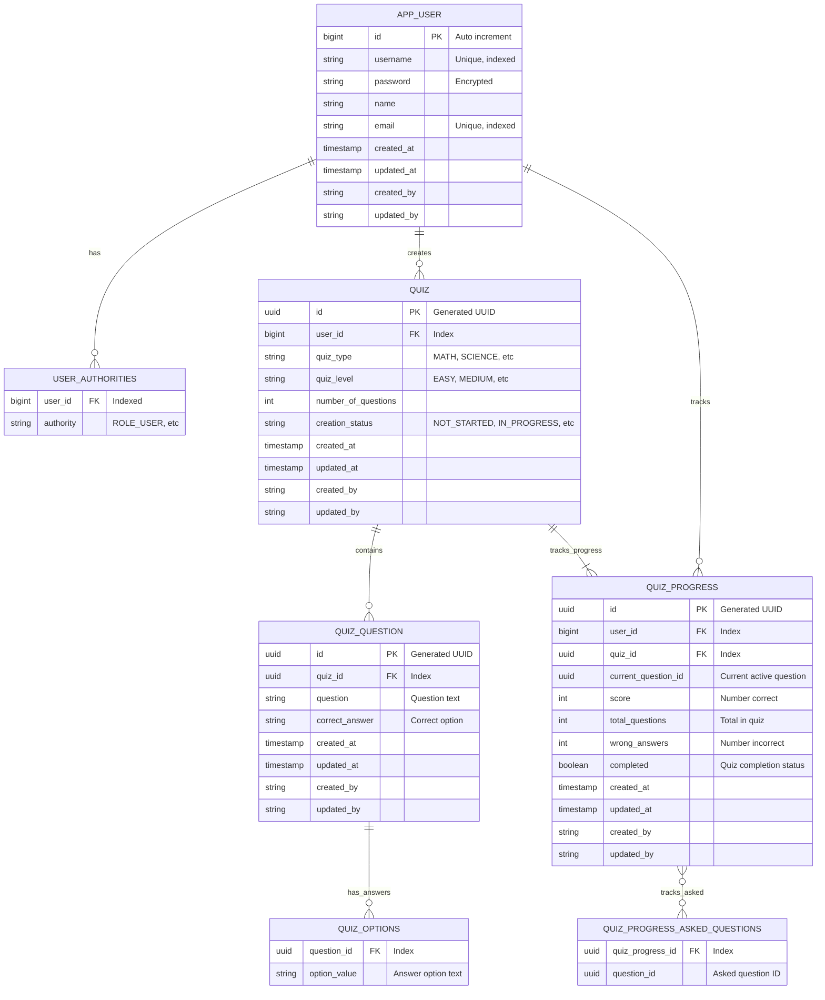

# Database Schema

```mermaid
erDiagram
    APP_USER ||--o{ USER_AUTHORITIES : has
    APP_USER ||--o{ QUIZ : creates
    APP_USER ||--o{ QUIZ_PROGRESS : tracks
    QUIZ ||--o{ QUIZ_QUESTION : contains
    QUIZ ||--|{ QUIZ_PROGRESS : tracks_progress
    QUIZ_QUESTION ||--o{ QUIZ_OPTIONS : has_answers
    QUIZ_PROGRESS }o--o{ QUIZ_PROGRESS_ASKED_QUESTIONS : tracks_asked

    APP_USER {
        bigint id PK "Auto increment"
        string username "Unique, indexed"
        string password "Encrypted"
        string name
        string email "Unique, indexed"
        timestamp created_at
        timestamp updated_at
        string created_by
        string updated_by
    }

    USER_AUTHORITIES {
        bigint user_id FK "Indexed"
        string authority "ROLE_USER, etc"
    }

    QUIZ {
        uuid id PK "Generated UUID"
        bigint user_id FK "Index"
        string quiz_type "MATH, SCIENCE, etc"
        string quiz_level "EASY, MEDIUM, etc" 
        int number_of_questions
        string creation_status "NOT_STARTED, IN_PROGRESS, etc"
        timestamp created_at
        timestamp updated_at 
        string created_by
        string updated_by
    }

    QUIZ_QUESTION {
        uuid id PK "Generated UUID"
        uuid quiz_id FK "Index"
        string question "Question text"
        string correct_answer "Correct option"
        timestamp created_at
        timestamp updated_at
        string created_by
        string updated_by
    }

    QUIZ_PROGRESS {
        uuid id PK "Generated UUID"
        bigint user_id FK "Index"
        uuid quiz_id FK "Index" 
        uuid current_question_id "Current active question"
        int score "Number correct"
        int total_questions "Total in quiz"
        int wrong_answers "Number incorrect"
        boolean completed "Quiz completion status"
        timestamp created_at
        timestamp updated_at
        string created_by
        string updated_by
    }

    QUIZ_OPTIONS {
        uuid question_id FK "Index"
        string option_value "Answer option text"
    }

    QUIZ_PROGRESS_ASKED_QUESTIONS {
        uuid quiz_progress_id FK "Index"
        uuid question_id "Asked question ID"
    }
```
