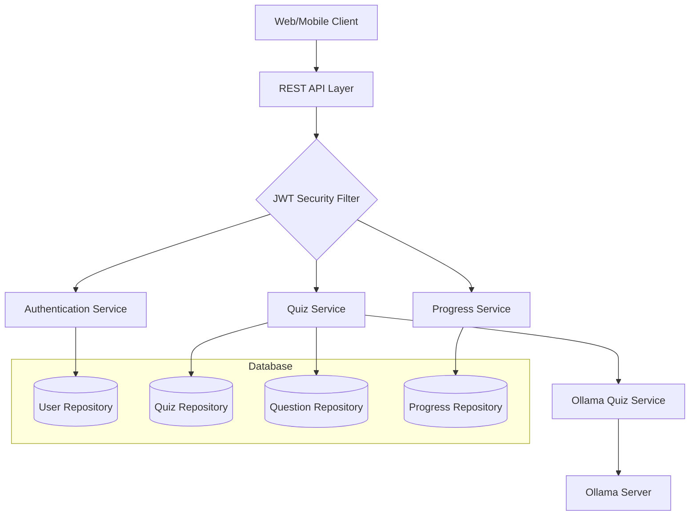
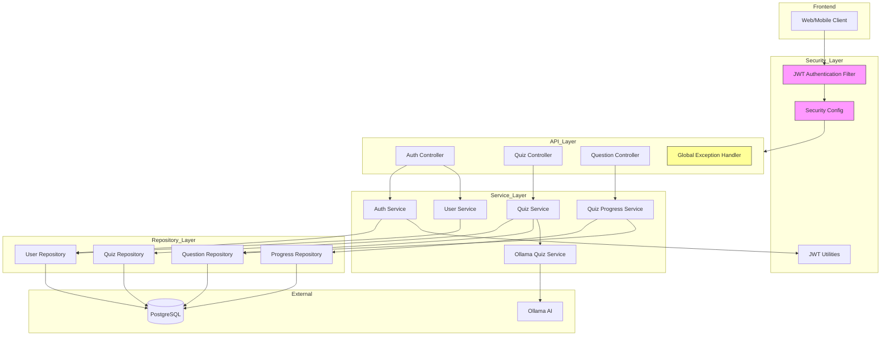
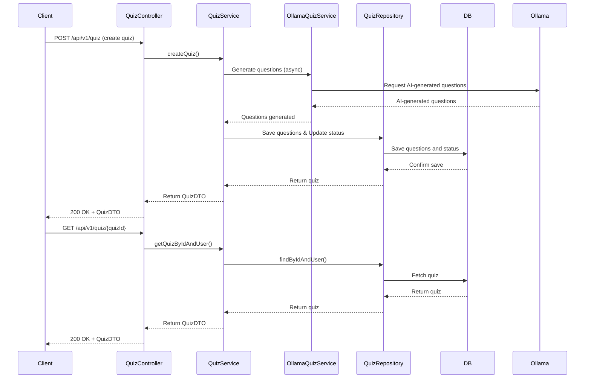
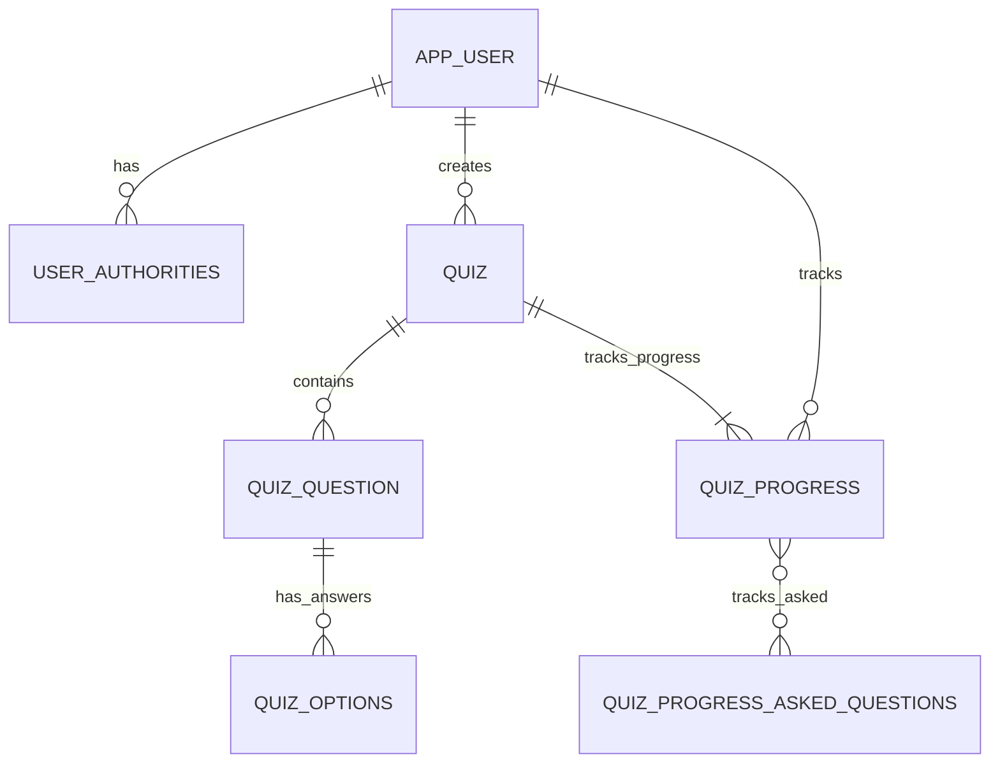

# Mind Maze AI - Project Flow & Architecture

## 1. High-Level Architecture

---

## 2. Detailed Component Diagram

---

## 3. Data Flow Example (Quiz Creation & Retrieval)

---

## 4. Database Schema (Entity Relationship Overview)

---

## 5. Key Features

- JWT-based authentication
- AI-powered quiz generation (Ollama integration)
- Async quiz processing
- RESTful API endpoints
- PostgreSQL data storage
- Health/metrics monitoring

---

> Use these diagrams and explanations to clearly communicate the flow and design of your project to your teacher.